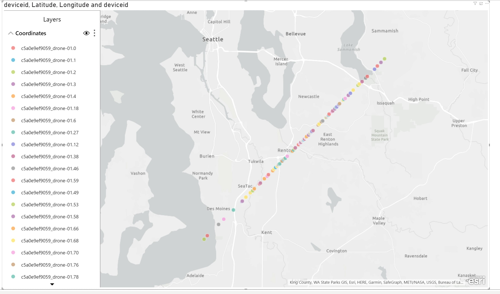

# Warm path function optimized for Azure SQL Database

This option for deploying Warm Path tier of an IoT solution is using Azure SQL Database as data store for telemetry events generated by drones.

Once deployed through the ARM template provided, you will create database objects as specified on deployment instructions and will end up with a database table with these attributes:

```SQL

CREATE TABLE events (deviceid varchar(50),timestamp datetime, geo varchar(255), json varchar(max))
GO
CREATE CLUSTERED COLUMNSTORE INDEX cci ON events
GO
CREATE NONCLUSTERED INDEX nclIdxDashboard ON [dbo].[events] ([deviceid],[timestamp]) INCLUDE (geo])

```

The events table stores a line for every message received from drones, and some attributes have been promoted from JSON message to relational columns, like deviceid, timestamp of received message, and geographic coordinates in a WKT compatible format. The entire message is stored in the json column.

This Azure Function option is using EventHub binding to receive messages from IoTHub, and is leveraging Azure SQL Database bulk copy capabilities to batch multiple events in a single database interaction, reducing roundtrips and improving transaction log throughput.
Key part of function's code is described here:

```C#
    await retryPolicy.ExecuteAsync(async ()=>
    { 
        using(SqlConnection cnn = new SqlConnection(SQLDBConnectionString))
        {
            cnn.Open();
            SqlBulkCopy bc = new SqlBulkCopy(cnn);
            bc.BatchSize=10000;
            bc.DestinationTableName="events";
            await bc.WriteToServerAsync(dt);
        }
    });
```

A Clustered ColumnStore index (cci) has been created to achieve both good compression rate and the ability to support free form queries on the event table.

A Non-clustered index has also been created to support the following query, which returns the last known position for all drones registered in the system:

```SQL

SELECT e.deviceid,
       e.timestamp,
       geography::STGeomFromText(e.geo, 4326).Lat as Lat,
       geography::STGeomFromText(e.geo, 4326).Long as Lon,
       json
FROM events e
WHERE e.timestamp = (SELECT MAX(e2.timestamp)
                 FROM events e2
                 WHERE e.deviceid = e2.deviceid)

```

The following image represent a sample PowerBI Dashboard that uses the previous query and plots done positions on a map based on the query above:



This is another query demonstration the power of geo-spatial query capabilities in Azure SQL Database by returning all drone IDs for those currently flying over US Pacific North West:

```SQL

SELECT DISTINCT e.deviceid
FROM events e
WHERE -- Parsing WTK coordinates of a polygon on a map obtained with a simple tool like http://arthur-e.github.io/Wicket/sandbox-gmaps3.html
    (geography::Parse('POLYGON((-126.76132982479679 48.653521290469634,-113.22617357479679 53.19181405420174,-110.06211107479679 43.602985324081914,-125.61875169979679 41.46610732362125,-126.76132982479679 48.653521290469634))').STContains(geography::STGeomFromText(e.geo, 4326)))=1

```
